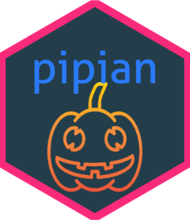

<!-- README.md is generated from README.Rmd. Please edit that file -->

```{r, include = FALSE}
knitr::opts_chunk$set(
  collapse = TRUE,
  comment = "#>",
  fig.path = "man/figures/README-",
  out.width = "100%"
)

require(magrittr)
```

# pipian <a href='https://paithiov909.github.io/pipian'></a>

<!-- badges: start -->

[](#)
[](https://travis-ci.com/paithiov909/pipian)

<!-- badges: end -->

## About

pipian is a tiny interface to [CaboCha](https://taku910.github.io/cabocha/); a Japanese dependency structure parser.

## Installation

``` R
remotes::install_github("paithiov909/pipian")
```

## Requirements

- MeCab (>= 0.996)
- CaboCha (>= 0.69)

## Usage

### Parsing dependency

```{r parse_dep}
res <- pipian::CabochaTbl("ふと振り向くと、たくさんの味方がいてたくさんの優しい人間がいることを、わざわざ自分の誕生日が来ないと気付けない自分を奮い立たせながらも、毎日こんな、湖のようななんの引っ掛かりもない、落ちつき倒し、音一つも感じさせない人間でいれる方に憧れを持てたとある25歳の眩しき朝のことでした")
res$tbl
```

### Plotting

``` R
res$plot()
```


### Getting dependency as flatXML

```{r flat_xml1}
head(pipian::cabochaFlatXML("ふと振り向くと、たくさんの味方がいてたくさんの優しい人間がいることを、わざわざ自分の誕生日が来ないと気付けない自分を奮い立たせながらも、毎日こんな、湖のようななんの引っ掛かりもない、落ちつき倒し、音一つも感じさせない人間でいれる方に憧れを持てたとある25歳の眩しき朝のことでした"))
```

### Converting flatXML into tibble compatible with CabochaR 

```{r flat_xml2}
res <- pipian::cabochaFlatXML("ふと振り向くと、たくさんの味方がいてたくさんの優しい人間がいることを、わざわざ自分の誕生日が来ないと気付けない自分を奮い立たせながらも、毎日こんな、湖のようななんの引っ掛かりもない、落ちつき倒し、音一つも感じさせない人間でいれる方に憧れを持てたとある25歳の眩しき朝のことでした") %>%
  pipian::CabochaR()
```

```{r flat_xml3}
res$morphs[[1]]
```

```{r flat_xml4}
res$as_tibble()
```

## Code of Conduct

Please note that the pipian project is released with a [Contributor Code of Conduct](https://paithiov909.github.io/pipian/CODE_OF_CONDUCT.html). By contributing to this project, you agree to abide by its terms.

## License

Copyright (c) 2020 Kato Akiru

Released under the MIT license https://github.com/paithiov909/pipian/blob/master/LICENSE

Icons made by [catkuro](https://www.flaticon.com/authors/catkuro) from [Flaticon](https://www.flaticon.com/)
