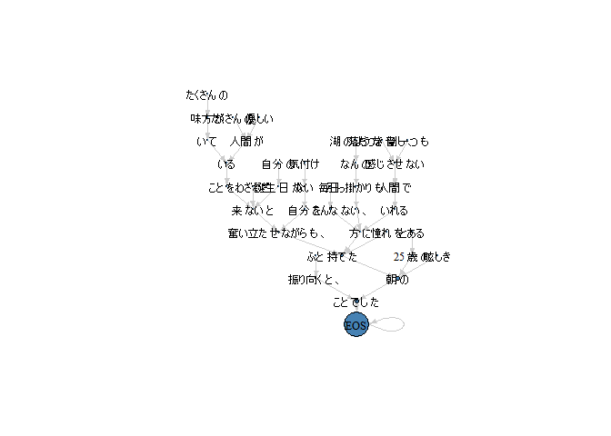

<!-- README.md is generated from README.Rmd. Please edit that file -->

# pipian <a href='https://paithiov909.github.io/pipian'></a>

<!-- badges: start -->

[](#)
[](https://www.tidyverse.org/lifecycle/#experimental)
<!-- badges: end -->

pipian is a tiny interface to
[CaboCha](https://taku910.github.io/cabocha/); a Japanese dependency
structure parser.

## System Requirements

-   MeCab
-   CaboCha
-   C++11

## Usage

### Installation

``` r
remotes::install_github("paithiov909/pipian")
```

### Plot dependency structure

``` r
sentence <- "ふと振り向くと、たくさんの味方がいてたくさんの優しい人間がいることを、わざわざ自分の誕生日が来ないと気付けない自分を奮い立たせながらも、毎日こんな、湖のようななんの引っ掛かりもない、落ちつき倒し、音一つも感じさせない人間でいれる方に憧れを持てたとある25歳の眩しき朝のことでした"

sentence %>% 
  pipian::ppn_cabocha() %>% 
  pipian::ppn_parse_xml() %>% 
  pipian::ppn_plot_igraph(sentence_id = 1L)
```



### Cast CaboCha output XML as data.table

``` r
sentence %>% 
  pipian::ppn_cabocha() %>% 
  pipian::ppn_parse_xml() %>% 
  pipian::ppn_as_tokenindex() %>% 
  head()
#>    doc_id sentence token_id    token chunk_score POS1     POS2 POS3 POS4
#> 1:      1        1     1110     ふと    1.287564 副詞     一般 <NA> <NA>
#> 2:      1        1     1121 振り向く   -2.336376 動詞     自立 <NA> <NA>
#> 3:      1        1     1122       と   -2.336376 助詞 接続助詞 <NA> <NA>
#> 4:      1        1     1123       、   -2.336376 記号     読点 <NA> <NA>
#> 5:      1        1     1134 たくさん    1.927252 名詞 副詞可能 <NA> <NA>
#> 6:      1        1     1135       の    1.927252 助詞   連体化 <NA> <NA>
#>         X5StageUse1 X5StageUse2 Original    Yomi1    Yomi2 entity relation
#> 1:             <NA>        <NA>     ふと     フト     フト   <NA>     ROOT
#> 2: 五段・カ行イ音便      基本形 振り向く フリムク フリムク   <NA>     動詞
#> 3:             <NA>        <NA>       と       ト       ト   <NA>     ROOT
#> 4:             <NA>        <NA>       、       、       、   <NA>     記号
#> 5:             <NA>        <NA> たくさん タクサン タクサン   <NA>     名詞
#> 6:             <NA>        <NA>       の       ノ       ノ   <NA>     ROOT
#>    parent
#> 1:     NA
#> 2:   1122
#> 3:     NA
#> 4:   1122
#> 5:   1135
#> 6:     NA
```

## License

MIT license.

Icons made by [catkuro](https://www.flaticon.com/authors/catkuro) from
[Flaticon](https://www.flaticon.com/).
